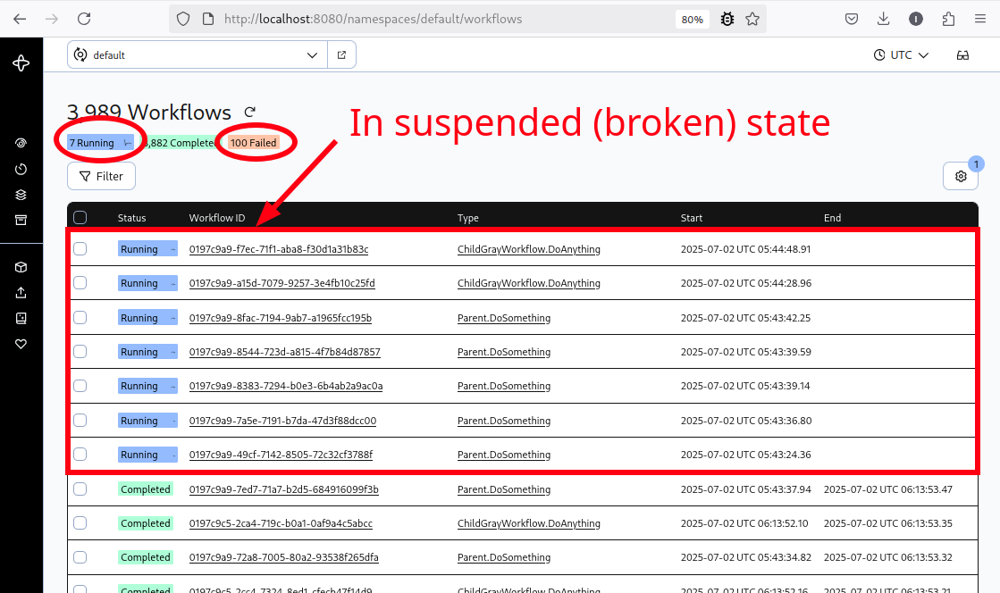

# Example of unexpected behavior Temporal php-sdk

This repo contains example of PHP application uses Temporal via Roadrunner, for demonstrates several bugs.

> Roadrunner runs **in single** replica, and have only 4 workers. It's emulate small resources. It's needed because
we are expected **to see bugs only in high concurrent conditions**. If roadrunner will be scaled, we probably can't see
errors.

Сode contains: 
- 3 workflows (one parent and two child)
- several activities
- `Workflow::await()` blocks of code, which unlocked workflow if signal was received

## Install

```shell
make install
```

Open Temporal UI: [http://localhost:8080](http://localhost:8080)

## How to reproduce bugs

Run cli script:

```shell
docker-compose exec app php app.php failed-example 2000
```

or:

```shell
make load
```

For repeat, run:

```shell
make again
```

What that script to do:

1. Starts 2000 workflows in short time period
2. Sends many signals in running child workflows

## Expected behavior

All workflows are in status `Completed` afterwards any time (durable execution), but it won't be like that.

## Actual behavior

- Any time ago, you will see `Failed` workflows
- After rr workers finish handle all payloads, we will see what several part of workflows during in suspended (Running) state.
  Follow the logic of this suspended workflows, they must be unblocked and finished after received the signal. 
  But it was not happened.

On my local environment (and not only), after all workflows was finish his useful works,
near 5% in average of all executions is **failed** or **suspended** in broken state:



## Screen recording video of script launching

[Link](https://www.dropbox.com/scl/fi/wrjg95j88f2ktexdwha7w/demonstrate-temporal-errors-2025-07-02_11.07.52.mp4?rlkey=pkj58ql56pfdphl26h9cdr3bn&e=1&st=rz8k5l2x&dl=0)

## Examples of several workflow executions in "Failed" status:

1. [c7d3aadd-206b-4967-8f7e-de992b1fe72c_events.json](./resources/c7d3aadd-206b-4967-8f7e-de992b1fe72c_events.json)

These workflows contain next errors:

```json
{
  "type": "workflowExecutionFailedEventAttributes",
  "failure": {
    "message": "child workflow execution error",
    "source": "GoSDK",
    "stackTrace": "/var/app/src/FailedExample/Workflow/ParentWorkflow.php:63\n/var/app/vendor/temporal/sdk/src/WorkerFactory.php:211\n/var/app/vendor/react/promise/src/FulfilledPromise.php:28\n/var/app/vendor/react/promise/src/Promise.php:134\n/var/app/vendor/react/promise/src/Promise.php:168\n/var/app/vendor/react/promise/src/Promise.php:231\n/var/app/vendor/react/promise/src/FulfilledPromise.php:42\n/var/app/vendor/react/promise/src/Promise.php:135\n/var/app/vendor/react/promise/src/Promise.php:168\n/var/app/vendor/react/promise/src/Promise.php:231\n/var/app/vendor/react/promise/src/Deferred.php:36\n/var/app/vendor/temporal/sdk/src/WorkerFactory.php:211\n/var/app/vendor/temporal/sdk/src/WorkerFactory.php:303\n/var/app/vendor/temporal/sdk/src/WorkerFactory.php:197\n/var/app/worker.php:55",
    "cause": {
      "message": "The passed value of type \"int\" can not be converted to required type \"array\"",
      "source": "PHP_SDK",
      "stackTrace": "#0  /var/app/vendor/temporal/sdk/src/DataConverter/JsonConverter.php:126\n    Temporal\\DataConverter\\JsonConverter->errorInvalidType(Temporal\\DataConverter\\Type,335)\n#1  /var/app/vendor/temporal/sdk/src/DataConverter/DataConverter.php:62\n    Temporal\\DataConverter\\JsonConverter->fromPayload(Temporal\\Api\\Common\\V1\\Payload,Temporal\\DataConverter\\Type)\n#2  /var/app/vendor/temporal/sdk/src/DataConverter/EncodedValues.php:137\n    Temporal\\DataConverter\\DataConverter->fromPayload(Temporal\\Api\\Common\\V1\\Payload,Temporal\\DataConverter\\Type)\n#3  /var/app/vendor/temporal/sdk/src/DataConverter/EncodedValues.php:87\n    Temporal\\DataConverter\\EncodedValues->getValue(0,Temporal\\DataConverter\\Type)\n#4  /var/app/vendor/temporal/sdk/src/Internal/Transport/CompletableResult.php:169\n    Temporal\\DataConverter\\EncodedValues::Temporal\\DataConverter\\{closure}(Temporal\\DataConverter\\EncodedValues)\n#5  /var/app/vendor/react/promise/src/FulfilledPromise.php:28\n    Temporal\\Internal\\Transport\\CompletableResult->Temporal\\Internal\\Transport\\{closure}(Temporal\\DataConverter\\EncodedValues)\n#6  /var/app/vendor/react/promise/src/Promise.php:134\n    React\\Promise\\FulfilledPromise->then(Closure,null)\n#7  /var/app/vendor/react/promise/src/Promise.php:168\n    React\\Promise\\Promise::React\\Promise\\{closure}(React\\Promise\\FulfilledPromise)\n#8  /var/app/vendor/react/promise/src/Promise.php:231\n    React\\Promise\\Promise->settle(React\\Promise\\FulfilledPromise)\n#9  /var/app/vendor/react/promise/src/Deferred.php:36\n    React\\Promise\\Promise::React\\Promise\\{closure}(Temporal\\DataConverter\\EncodedValues)\n#10 /var/app/vendor/temporal/sdk/src/Internal/Transport/CompletableResult.php:137\n    React\\Promise\\Deferred->resolve(Temporal\\DataConverter\\EncodedValues)\n#11 /var/app/vendor/temporal/sdk/src/Internal/Events/EventEmitterTrait.php:41\n    Temporal\\Internal\\Transport\\CompletableResult->Temporal\\Internal\\Transport\\{closure}()\n#12 /var/app/vendor/temporal/sdk/src/WorkerFactory.php:211\n    Temporal\\WorkerFactory->emit(\"tick\")\n#13 /var/app/vendor/temporal/sdk/src/WorkerFactory.php:303\n    Temporal\\WorkerFactory->tick()\n#14 /var/app/vendor/temporal/sdk/src/WorkerFactory.php:197\n    Temporal\\WorkerFactory->dispatch(\"\\nn\\b\ufffdm*\\u001f\\n\\u001d\\n\\u0016\\n\\bencoding\\u0012\\njson\\/plain\\u0012\\u00033358\\u000bB$beee9719...\",array(6))\n#15 /var/app/worker.php:55\n    Temporal\\WorkerFactory->run()",
      "applicationFailureInfo": {
        "type": "Temporal\\Exception\\DataConverterException"
      }
    },
    "childWorkflowExecutionFailureInfo": {
      "namespace": "default",
      "workflowExecution": {
        "workflowId": "0197c9aa-374e-7135-8fdf-d42528fb2ca0",
        "runId": "04826fa4-494c-4e07-a9ee-7ab2499412e8"
      },
      "workflowType": {
        "name": "ChildWhiteWorkflow.DoAnything"
      },
      "initiatedEventId": "25",
      "startedEventId": "26",
      "retryState": "RETRY_STATE_RETRY_POLICY_NOT_SET"
    }
  },
  "retryState": "RETRY_STATE_RETRY_POLICY_NOT_SET",
  "workflowTaskCompletedEventId": "36"
}
```

```json
{
  "message": "undefined response: Got the response to undefined request 12695",
  "source": "GoSDK",
  "stackTrace": "process event for default [panic]:\ngithub.com/temporalio/roadrunner-temporal/v5/aggregatedpool.(*Workflow).OnWorkflowTaskStarted(0xc001a5cc40, 0x20?)\n\tgithub.com/temporalio/roadrunner-temporal/v5@v5.6.0/aggregatedpool/workflow.go:322 +0x3b4\ngo.temporal.io/sdk/internal.(*workflowExecutionEventHandlerImpl).ProcessEvent(0xc001f74240, 0xc006abe7e0, 0x80?, 0x1)\n\tgo.temporal.io/sdk@v1.34.0/internal/internal_event_handlers.go:1226 +0x30a\ngo.temporal.io/sdk/internal.(*workflowExecutionContextImpl).ProcessWorkflowTask(0xc00238b400, 0xc0048b3c50)\n\tgo.temporal.io/sdk@v1.34.0/internal/internal_task_handlers.go:1194 +0x1a8a\ngo.temporal.io/sdk/internal.(*workflowTaskHandlerImpl).ProcessWorkflowTask(0xc002fdc300, 0xc0048b3c50, 0xc00238b400, 0xc009c9d110)\n\tgo.temporal.io/sdk@v1.34.0/internal/internal_task_handlers.go:941 +0x59e\ngo.temporal.io/sdk/internal.(*workflowTaskPoller).processWorkflowTask(0xc0020863c0, 0xc0048b3c50)\n\tgo.temporal.io/sdk@v1.34.0/internal/internal_task_pollers.go:424 +0x3db\ngo.temporal.io/sdk/internal.(*workflowTaskPoller).ProcessTask(0xc0020863c0, {0x1f79ea0, 0xc0048b3c50})\n\tgo.temporal.io/sdk@v1.34.0/internal/internal_task_pollers.go:372 +0x205\ngo.temporal.io/sdk/internal.(*baseWorker).processTaskAsync.func1()\n\tgo.temporal.io/sdk@v1.34.0/internal/internal_worker_base.go:456 +0x12f\ncreated by go.temporal.io/sdk/internal.(*baseWorker).processTaskAsync in goroutine 25928\n\tgo.temporal.io/sdk@v1.34.0/internal/internal_worker_base.go:435 +0x8c",
  "applicationFailureInfo": {
    "type": "PanicError",
    "nonRetryable": true
  }
}

process event for default [panic]:
github.com/temporalio/roadrunner-temporal/v5/aggregatedpool.(*Workflow).OnWorkflowTaskStarted(0xc001a5cc40, 0x20?)
	github.com/temporalio/roadrunner-temporal/v5@v5.6.0/aggregatedpool/workflow.go:322 +0x3b4
go.temporal.io/sdk/internal.(*workflowExecutionEventHandlerImpl).ProcessEvent(0xc001f74240, 0xc006abe7e0, 0x80?, 0x1)
	go.temporal.io/sdk@v1.34.0/internal/internal_event_handlers.go:1226 +0x30a
go.temporal.io/sdk/internal.(*workflowExecutionContextImpl).ProcessWorkflowTask(0xc00238b400, 0xc0048b3c50)
	go.temporal.io/sdk@v1.34.0/internal/internal_task_handlers.go:1194 +0x1a8a
go.temporal.io/sdk/internal.(*workflowTaskHandlerImpl).ProcessWorkflowTask(0xc002fdc300, 0xc0048b3c50, 0xc00238b400, 0xc009c9d110)
	go.temporal.io/sdk@v1.34.0/internal/internal_task_handlers.go:941 +0x59e
go.temporal.io/sdk/internal.(*workflowTaskPoller).processWorkflowTask(0xc0020863c0, 0xc0048b3c50)
	go.temporal.io/sdk@v1.34.0/internal/internal_task_pollers.go:424 +0x3db
go.temporal.io/sdk/internal.(*workflowTaskPoller).ProcessTask(0xc0020863c0, {0x1f79ea0, 0xc0048b3c50})
	go.temporal.io/sdk@v1.34.0/internal/internal_task_pollers.go:372 +0x205
go.temporal.io/sdk/internal.(*baseWorker).processTaskAsync.func1()
	go.temporal.io/sdk@v1.34.0/internal/internal_worker_base.go:456 +0x12f
created by go.temporal.io/sdk/internal.(*baseWorker).processTaskAsync in goroutine 25928
	go.temporal.io/sdk@v1.34.0/internal/internal_worker_base.go:435 +0x8c
```

and his child: [04826fa4-494c-4e07-a9ee-7ab2499412e8_events.json](./resources/04826fa4-494c-4e07-a9ee-7ab2499412e8_events.json)

Error:

```json
{
  "type": "workflowExecutionFailedEventAttributes",
  "failure": {
    "message": "The passed value of type \"int\" can not be converted to required type \"array\"",
    "source": "PHP_SDK",
    "stackTrace": "#0  /var/app/vendor/temporal/sdk/src/DataConverter/JsonConverter.php:126\n    Temporal\\DataConverter\\JsonConverter->errorInvalidType(Temporal\\DataConverter\\Type,335)\n#1  /var/app/vendor/temporal/sdk/src/DataConverter/DataConverter.php:62\n    Temporal\\DataConverter\\JsonConverter->fromPayload(Temporal\\Api\\Common\\V1\\Payload,Temporal\\DataConverter\\Type)\n#2  /var/app/vendor/temporal/sdk/src/DataConverter/EncodedValues.php:137\n    Temporal\\DataConverter\\DataConverter->fromPayload(Temporal\\Api\\Common\\V1\\Payload,Temporal\\DataConverter\\Type)\n#3  /var/app/vendor/temporal/sdk/src/DataConverter/EncodedValues.php:87\n    Temporal\\DataConverter\\EncodedValues->getValue(0,Temporal\\DataConverter\\Type)\n#4  /var/app/vendor/temporal/sdk/src/Internal/Transport/CompletableResult.php:169\n    Temporal\\DataConverter\\EncodedValues::Temporal\\DataConverter\\{closure}(Temporal\\DataConverter\\EncodedValues)\n#5  /var/app/vendor/react/promise/src/FulfilledPromise.php:28\n    Temporal\\Internal\\Transport\\CompletableResult->Temporal\\Internal\\Transport\\{closure}(Temporal\\DataConverter\\EncodedValues)\n#6  /var/app/vendor/react/promise/src/Promise.php:134\n    React\\Promise\\FulfilledPromise->then(Closure,null)\n#7  /var/app/vendor/react/promise/src/Promise.php:168\n    React\\Promise\\Promise::React\\Promise\\{closure}(React\\Promise\\FulfilledPromise)\n#8  /var/app/vendor/react/promise/src/Promise.php:231\n    React\\Promise\\Promise->settle(React\\Promise\\FulfilledPromise)\n#9  /var/app/vendor/react/promise/src/Deferred.php:36\n    React\\Promise\\Promise::React\\Promise\\{closure}(Temporal\\DataConverter\\EncodedValues)\n#10 /var/app/vendor/temporal/sdk/src/Internal/Transport/CompletableResult.php:137\n    React\\Promise\\Deferred->resolve(Temporal\\DataConverter\\EncodedValues)\n#11 /var/app/vendor/temporal/sdk/src/Internal/Events/EventEmitterTrait.php:41\n    Temporal\\Internal\\Transport\\CompletableResult->Temporal\\Internal\\Transport\\{closure}()\n#12 /var/app/vendor/temporal/sdk/src/WorkerFactory.php:211\n    Temporal\\WorkerFactory->emit(\"tick\")\n#13 /var/app/vendor/temporal/sdk/src/WorkerFactory.php:303\n    Temporal\\WorkerFactory->tick()\n#14 /var/app/vendor/temporal/sdk/src/WorkerFactory.php:197\n    Temporal\\WorkerFactory->dispatch(\"\\nn\\b\ufffdm*\\u001f\\n\\u001d\\n\\u0016\\n\\bencoding\\u0012\\njson\\/plain\\u0012\\u00033358\\u000bB$beee9719...\",array(6))\n#15 /var/app/worker.php:55\n    Temporal\\WorkerFactory->run()",
    "applicationFailureInfo": {
      "type": "Temporal\\Exception\\DataConverterException"
    }
  },
  "retryState": "RETRY_STATE_RETRY_POLICY_NOT_SET",
  "workflowTaskCompletedEventId": "12"
}
```

2. [7336420c-0b2c-4891-bc29-9eb07a7d68e0_events.json](./resources/7336420c-0b2c-4891-bc29-9eb07a7d68e0_events.json)

These workflows contain next errors:

```json
{"message":"Class \"yes\" does not exist","source":"PHP_SDK","stackTrace":"#0  /var/app/vendor/temporal/sdk/src/Internal/Declaration/Reader/WorkflowReader.php:77\n    ReflectionClass->__construct(\"yes\")\n[4 hidden internal calls]\n#5  /var/app/vendor/temporal/sdk/src/Internal/Workflow/Process/DeferredGenerator.php:82\n    Generator->send(\"yes\")\n[6 hidden internal calls]\n#12 /var/app/vendor/react/promise/src/Promise.php:134\n    React\\Promise\\FulfilledPromise->then(Closure,Closure)\n#13 /var/app/vendor/react/promise/src/Promise.php:168\n    React\\Promise\\Promise::React\\Promise\\{closure}(React\\Promise\\FulfilledPromise)\n#14 /var/app/vendor/react/promise/src/Promise.php:231\n    React\\Promise\\Promise->settle(React\\Promise\\FulfilledPromise)\n#15 /var/app/vendor/react/promise/src/FulfilledPromise.php:42\n    React\\Promise\\Promise::React\\Promise\\{closure}(\"yes\")\n#16 /var/app/vendor/react/promise/src/Promise.php:135\n    React\\Promise\\FulfilledPromise->done(Closure,Closure,Closure)\n#17 /var/app/vendor/react/promise/src/Promise.php:168\n    React\\Promise\\Promise::React\\Promise\\{closure}(React\\Promise\\FulfilledPromise)\n#18 /var/app/vendor/react/promise/src/Promise.php:231\n    React\\Promise\\Promise->settle(React\\Promise\\FulfilledPromise)\n#19 /var/app/vendor/react/promise/src/Deferred.php:36\n    React\\Promise\\Promise::React\\Promise\\{closure}(Temporal\\DataConverter\\EncodedValues)\n#20 /var/app/vendor/temporal/sdk/src/Internal/Transport/CompletableResult.php:137\n    React\\Promise\\Deferred->resolve(Temporal\\DataConverter\\EncodedValues)\n[5 hidden internal calls]","applicationFailureInfo":{"type":"ReflectionException"}}

#0  /var/app/vendor/temporal/sdk/src/Internal/Declaration/Reader/WorkflowReader.php:77
    ReflectionClass->__construct("yes")
[4 hidden internal calls]
#5  /var/app/vendor/temporal/sdk/src/Internal/Workflow/Process/DeferredGenerator.php:82
    Generator->send("yes")
[6 hidden internal calls]
#12 /var/app/vendor/react/promise/src/Promise.php:134
    React\Promise\FulfilledPromise->then(Closure,Closure)
#13 /var/app/vendor/react/promise/src/Promise.php:168
    React\Promise\Promise::React\Promise\{closure}(React\Promise\FulfilledPromise)
#14 /var/app/vendor/react/promise/src/Promise.php:231
    React\Promise\Promise->settle(React\Promise\FulfilledPromise)
#15 /var/app/vendor/react/promise/src/FulfilledPromise.php:42
    React\Promise\Promise::React\Promise\{closure}("yes")
#16 /var/app/vendor/react/promise/src/Promise.php:135
    React\Promise\FulfilledPromise->done(Closure,Closure,Closure)
#17 /var/app/vendor/react/promise/src/Promise.php:168
    React\Promise\Promise::React\Promise\{closure}(React\Promise\FulfilledPromise)
#18 /var/app/vendor/react/promise/src/Promise.php:231
    React\Promise\Promise->settle(React\Promise\FulfilledPromise)
#19 /var/app/vendor/react/promise/src/Deferred.php:36
    React\Promise\Promise::React\Promise\{closure}(Temporal\DataConverter\EncodedValues)
#20 /var/app/vendor/temporal/sdk/src/Internal/Transport/CompletableResult.php:137
    React\Promise\Deferred->resolve(Temporal\DataConverter\EncodedValues)
[5 hidden internal calls]
```

```json
{
  "message": "undefined response: Got the response to undefined request 11796",
  "source": "GoSDK",
  "stackTrace": "process event for default [panic]:\ngithub.com/temporalio/roadrunner-temporal/v5/aggregatedpool.(*Workflow).OnWorkflowTaskStarted(0xc001793c00, 0xe?)\n\tgithub.com/temporalio/roadrunner-temporal/v5@v5.6.0/aggregatedpool/workflow.go:322 +0x3b4\ngo.temporal.io/sdk/internal.(*workflowExecutionEventHandlerImpl).ProcessEvent(0xc0030424f8, 0xc0067c8630, 0x80?, 0x1)\n\tgo.temporal.io/sdk@v1.34.0/internal/internal_event_handlers.go:1226 +0x30a\ngo.temporal.io/sdk/internal.(*workflowExecutionContextImpl).ProcessWorkflowTask(0xc002b20f00, 0xc00236edb0)\n\tgo.temporal.io/sdk@v1.34.0/internal/internal_task_handlers.go:1194 +0x1a8a\ngo.temporal.io/sdk/internal.(*workflowTaskHandlerImpl).ProcessWorkflowTask(0xc002fdc300, 0xc00236edb0, 0xc002b20f00, 0xc000e243c0)\n\tgo.temporal.io/sdk@v1.34.0/internal/internal_task_handlers.go:941 +0x59e\ngo.temporal.io/sdk/internal.(*workflowTaskPoller).processWorkflowTask(0xc0020863c0, 0xc00236edb0)\n\tgo.temporal.io/sdk@v1.34.0/internal/internal_task_pollers.go:424 +0x3db\ngo.temporal.io/sdk/internal.(*workflowTaskPoller).ProcessTask(0xc0020863c0, {0x1f79ea0, 0xc00236edb0})\n\tgo.temporal.io/sdk@v1.34.0/internal/internal_task_pollers.go:372 +0x205\ngo.temporal.io/sdk/internal.(*baseWorker).processTaskAsync.func1()\n\tgo.temporal.io/sdk@v1.34.0/internal/internal_worker_base.go:456 +0x12f\ncreated by go.temporal.io/sdk/internal.(*baseWorker).processTaskAsync in goroutine 25928\n\tgo.temporal.io/sdk@v1.34.0/internal/internal_worker_base.go:435 +0x8c",
  "applicationFailureInfo": {
    "type": "PanicError",
    "nonRetryable": true
  }
}

process event for default [panic]:
github.com/temporalio/roadrunner-temporal/v5/aggregatedpool.(*Workflow).OnWorkflowTaskStarted(0xc001793c00, 0xe?)
	github.com/temporalio/roadrunner-temporal/v5@v5.6.0/aggregatedpool/workflow.go:322 +0x3b4
go.temporal.io/sdk/internal.(*workflowExecutionEventHandlerImpl).ProcessEvent(0xc0030424f8, 0xc0067c8630, 0x80?, 0x1)
	go.temporal.io/sdk@v1.34.0/internal/internal_event_handlers.go:1226 +0x30a
go.temporal.io/sdk/internal.(*workflowExecutionContextImpl).ProcessWorkflowTask(0xc002b20f00, 0xc00236edb0)
	go.temporal.io/sdk@v1.34.0/internal/internal_task_handlers.go:1194 +0x1a8a
go.temporal.io/sdk/internal.(*workflowTaskHandlerImpl).ProcessWorkflowTask(0xc002fdc300, 0xc00236edb0, 0xc002b20f00, 0xc000e243c0)
	go.temporal.io/sdk@v1.34.0/internal/internal_task_handlers.go:941 +0x59e
go.temporal.io/sdk/internal.(*workflowTaskPoller).processWorkflowTask(0xc0020863c0, 0xc00236edb0)
	go.temporal.io/sdk@v1.34.0/internal/internal_task_pollers.go:424 +0x3db
go.temporal.io/sdk/internal.(*workflowTaskPoller).ProcessTask(0xc0020863c0, {0x1f79ea0, 0xc00236edb0})
	go.temporal.io/sdk@v1.34.0/internal/internal_task_pollers.go:372 +0x205
go.temporal.io/sdk/internal.(*baseWorker).processTaskAsync.func1()
	go.temporal.io/sdk@v1.34.0/internal/internal_worker_base.go:456 +0x12f
created by go.temporal.io/sdk/internal.(*baseWorker).processTaskAsync in goroutine 25928
	go.temporal.io/sdk@v1.34.0/internal/internal_worker_base.go:435 +0x8c
```

3. [8097e25e-1f47-48ed-94c0-219cf5b75b5e_events.json](./resources/8097e25e-1f47-48ed-94c0-219cf5b75b5e_events.json)

Errors:

```json
{
  "type": "workflowExecutionFailedEventAttributes",
  "failure": {
    "message": "The passed value of type \"array\" can not be converted to required type \"int\"",
    "source": "PHP_SDK",
    "stackTrace": "#0  /var/app/vendor/temporal/sdk/src/DataConverter/JsonConverter.php:112\n    Temporal\\DataConverter\\JsonConverter->errorInvalidType(Temporal\\DataConverter\\Type,array(4))\n#1  /var/app/vendor/temporal/sdk/src/DataConverter/DataConverter.php:62\n    Temporal\\DataConverter\\JsonConverter->fromPayload(Temporal\\Api\\Common\\V1\\Payload,Temporal\\DataConverter\\Type)\n#2  /var/app/vendor/temporal/sdk/src/DataConverter/EncodedValues.php:137\n    Temporal\\DataConverter\\DataConverter->fromPayload(Temporal\\Api\\Common\\V1\\Payload,Temporal\\DataConverter\\Type)\n#3  /var/app/vendor/temporal/sdk/src/DataConverter/EncodedValues.php:87\n    Temporal\\DataConverter\\EncodedValues->getValue(0,ReflectionNamedType)\n#4  /var/app/vendor/temporal/sdk/src/Internal/Transport/CompletableResult.php:169\n    Temporal\\DataConverter\\EncodedValues::Temporal\\DataConverter\\{closure}(Temporal\\DataConverter\\EncodedValues)\n#5  /var/app/vendor/react/promise/src/FulfilledPromise.php:28\n    Temporal\\Internal\\Transport\\CompletableResult->Temporal\\Internal\\Transport\\{closure}(Temporal\\DataConverter\\EncodedValues)\n#6  /var/app/vendor/react/promise/src/Promise.php:134\n    React\\Promise\\FulfilledPromise->then(Closure,null)\n#7  /var/app/vendor/react/promise/src/Promise.php:168\n    React\\Promise\\Promise::React\\Promise\\{closure}(React\\Promise\\FulfilledPromise)\n#8  /var/app/vendor/react/promise/src/Promise.php:231\n    React\\Promise\\Promise->settle(React\\Promise\\FulfilledPromise)\n#9  /var/app/vendor/react/promise/src/Deferred.php:36\n    React\\Promise\\Promise::React\\Promise\\{closure}(Temporal\\DataConverter\\EncodedValues)\n#10 /var/app/vendor/temporal/sdk/src/Internal/Transport/CompletableResult.php:137\n    React\\Promise\\Deferred->resolve(Temporal\\DataConverter\\EncodedValues)\n#11 /var/app/vendor/temporal/sdk/src/Internal/Events/EventEmitterTrait.php:41\n    Temporal\\Internal\\Transport\\CompletableResult->Temporal\\Internal\\Transport\\{closure}()\n#12 /var/app/vendor/temporal/sdk/src/WorkerFactory.php:211\n    Temporal\\WorkerFactory->emit(\"tick\")\n#13 /var/app/vendor/temporal/sdk/src/WorkerFactory.php:303\n    Temporal\\WorkerFactory->tick()\n#14 /var/app/vendor/temporal/sdk/src/WorkerFactory.php:197\n    Temporal\\WorkerFactory->dispatch(\"\\n\ufffd\\u0001\\b\ufffd`*c\\na\\n\\u0016\\n\\bencoding\\u0012\\njson\\/plain\\u0012G[\\\"Hello from C...\",array(6))\n#15 /var/app/worker.php:55\n    Temporal\\WorkerFactory->run()",
    "applicationFailureInfo": {
      "type": "Temporal\\Exception\\DataConverterException"
    }
  },
  "retryState": "RETRY_STATE_RETRY_POLICY_NOT_SET",
  "workflowTaskCompletedEventId": "33"
}
```

## Observe errors

- In Temporal UI (failed and suspended workflows)
- In logs of docker service `app` (`docker-compose logs app`)

